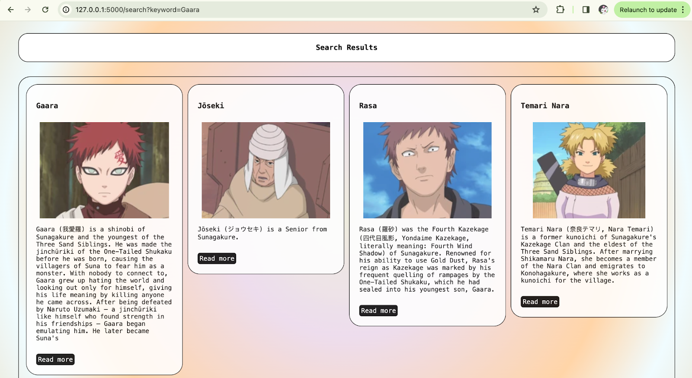

# Search System for Naruto Characters' information
---
This project is an implementation of a comprehensive search system for Naruto characters’ information. The primary goal of this search system is to provide insights and detailed information about Naruto characters to fans who are interested in an accessible platform to learn more about the information that they might not know about Naruto characters. Furthermore, it is beneficial for individuals who are unfamiliar with Naruto and would like to discover more about Naruto characters.

There are a total of 105 Naruto characters in this search system with information about their names, descriptions, affiliations, background information, abilities, and pictures that the users can search for in the **naruto2.json** file

This search system utilizes Elasticsearch and Kibana for indexing and querying the data with the use of Flask framework for building web applications in Python.

To run this project, you will have to install Elasticsearch and Kibana on your machine.
```
https://www.elastic.co/downloads/elasticsearch
```

Additionally, you have to install Python3 and Flask
```
Python3 installation instructions: https://realpython.com/installing-python/
```
```
Flask installation instructions: https://flask.palletsprojects.com/en/3.0.x/installation/
```

Afterward, you have to import **naruto2.json** into your Kibana.

Then, change the Elasticsearch password in search_app.py to match your password
```
ELASTIC_PASSWORD = "YOUR_PASSWORD"
```

Finally, to run the program type in the terminal.

for Linux & MacOS
```
export FLASK_APP=search_app.py
flask run
```
for Windows
```
set FLASK_APP=search_app.py
flask run
```
---

## Snapshot of the Search System:



